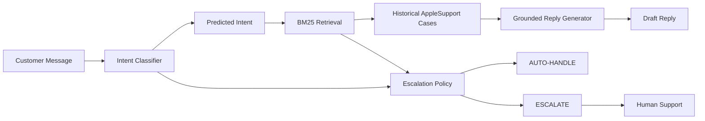

# SupportLens

SupportLens is an AI-driven customer support agent designed to handle Twitter queries for AppleSupport. It automates initial triage, information retrieval, and draft response generation while safely escalating high-risk or complex problems to human agents.

**Note**: This system is a proof-of-concept and is **not production-ready**.

## Problem Statement

Customer support on social media platforms like Twitter is characterized by high volume, urgent technical requests, and the expectation of rapid, accurate responses. Brands face a significant challenge in scaling human support teams to handle repetitive queries while maintaining quality. The objective of SupportLens is to resolve standard technical issues autonomously and intelligently route issues requiring human attention.

## Dataset & AppleSupport Selection

The project utilizes the Kaggle ["Customer Support on Twitter"](https://www.kaggle.com/datasets/thoughtvector/customer-support-on-twitter) dataset. 
From the 2,811,774 total tweets, we filtered for those involving `AppleSupport` (April 14, 2017 – September 27, 2017), yielding 106,860 tweets and 106,646 valid direct customer-response pairs. Support threads were reconstructed to provide adequate context.

## 11-Intent Taxonomy

Based on observed messages, we defined a custom taxonomy to categorize customer problems:
1. `ios_update`
2. `battery_charging`
3. `app_issue`
4. `device_performance`
5. `connectivity`
6. `hardware_display`
7. `apple_id_account`
8. `icloud_data`
9. `media_services`
10. `billing_payments`
11. `other_insufficient_information`

## System Architecture



SupportLens operates as a sequential pipeline:
1. **Intent Classification**: Categorizes the incoming customer message.
2. **BM25 Retrieval**: Searches historical AppleSupport cases to find relevant past resolutions.
3. **Escalation Policy**: A deterministic policy checks for safety concerns, data loss, account issues, missing retrieval evidence, and unsupported intents to decide whether to `ESCALATE` to a human or `AUTO-HANDLE`.
4. **Grounded Generation**: Uses the retrieved historical cases as factual grounding to draft a helpful, accurate reply.

## Installation

```bash
git clone https://github.com/KISHOR-glitch/Customer-Support-Agent.git
cd Customer-Support-Agent
python -m venv venv
source venv/bin/activate  # On Windows: venv\Scripts\activate
pip install -r requirements.txt
```

## Environment Variables

Create a `.env` file in the root directory (this file is ignored by Git). If an LLM-as-judge or API-based generation is used, define your keys:

```
OPENROUTER_API_KEY=your_key_here
```

## Usage

### How to Run the Agent

*(Assuming relevant entrypoint scripts exist in `scripts/`)*
```bash
python scripts/run_agent.py
```

### How to Run Evaluation

```bash
python scripts/final_evaluation.py
```

## Evaluation Results

### Baselines

To validate task complexity, baselines were evaluated on an earlier subset of the golden set:
- **Majority baseline**: Accuracy = 37.50%, Macro F1 = 0.0496
- **Keyword baseline**: Accuracy = 60.00%, Macro F1 = 0.5103
- **TF-IDF + Logistic Regression**: Accuracy = 40.00%, Macro F1 = 0.2167

### Current System Performance

Evaluated on the 50-case human evaluation set. *Note: this set was also used during development/tuning, so these represent development/human-evaluation results rather than unbiased production estimates.*

- **Intent Classifier**: Accuracy = 76.00%, Macro F1 = 0.7899
- **Retrieval**: Recall@1 = 50.00%, Recall@3 = 78.00%, Recall@5 = 82.00%, MRR = 0.6367
  *(These are intent-agreement proxy metrics, NOT human retrieval relevance judgments)*
- **Reply Quality**: Good = 15/50 (30%), Acceptable = 31/50 (62%), Bad = 4/50 (8%). Acceptable-or-better = 92%
- **Escalation**: Accuracy = 84.00%, ESCALATE precision = 1.0000, ESCALATE recall = 0.8298

## Known Limitations

- **LLM-as-judge Limitation**: The LLM-as-judge evaluation was implemented, but after refining the judging rubric, re-evaluation was blocked by the external provider's daily free-tier request limit. Stale pre-refinement judge outputs were therefore excluded from the final headline metrics.
- Multiple symptoms / competing intents can confuse the rule-based intent classifier.
- Escalation sometimes triggers on high-risk keywords even when retrieval evidence strongly supports a safe automated answer.
