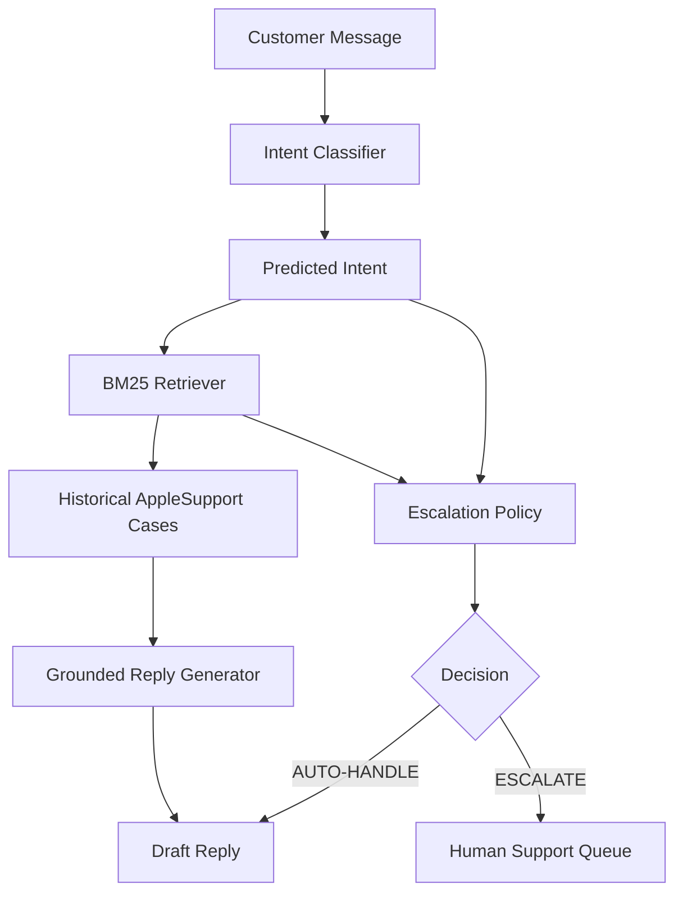

# SupportLens System Architecture

SupportLens is an AI-driven customer support agent designed to handle Twitter queries for AppleSupport. The system leverages a pipeline approach combining intent classification, retrieval-augmented generation (RAG), and a deterministic escalation policy.

## Architecture Diagram

## Components

### 1. Intent Classifier
The pipeline begins by analyzing the incoming customer message to determine its core problem. The classifier categorizes the message into one of 11 predefined intents (e.g., `ios_update`, `battery_charging`, `apple_id_account`). This structured understanding is crucial for subsequent routing and retrieval steps.

### 2. BM25 Retriever
Once the intent is classified, the system searches a historical database of 94,362 cleaned AppleSupport threads. Using the BM25 algorithm, it retrieves previous cases that match the current query lexically and contextually. This ensures the system draws upon actual, successful resolutions rather than generating answers from scratch.

### 3. Grounded Reply Generator
Using the original customer message and the context provided by the retrieved historical cases, the system generates a helpful draft reply. This grounding mechanism drastically reduces hallucination and ensures the tone and technical advice align with established AppleSupport practices.

### 4. Escalation Policy
In parallel, a deterministic policy evaluates whether the case is safe for automated handling (`AUTO-HANDLE`) or requires human intervention (`ESCALATE`). The policy evaluates:
- **Unsupported Intents**: Certain problem categories are flagged for escalation.
- **Retrieval Evidence**: A lack of relevant historical cases triggers an escalation.
- **Safety & Risk**: Keywords indicating safety hazards (fire, smoke, burn, explode, overheat, heat, swollen, shock, electric), data loss, or account/authentication issues mandate human review.
- **Persistence**: Language indicating repeated failures (constantly, keeps, every time, still, continues), multiple significant symptoms, software-update regression, serious hardware malfunctions, explicit requests for human investigation, or feature requests also force an escalation.

### 5. Final Decision
If the Escalation Policy decides to `AUTO-HANDLE`, the draft reply from the Grounded Reply Generator is sent to the customer. If the policy decides to `ESCALATE`, the case is routed to the human support queue, bypassing the automated response.
