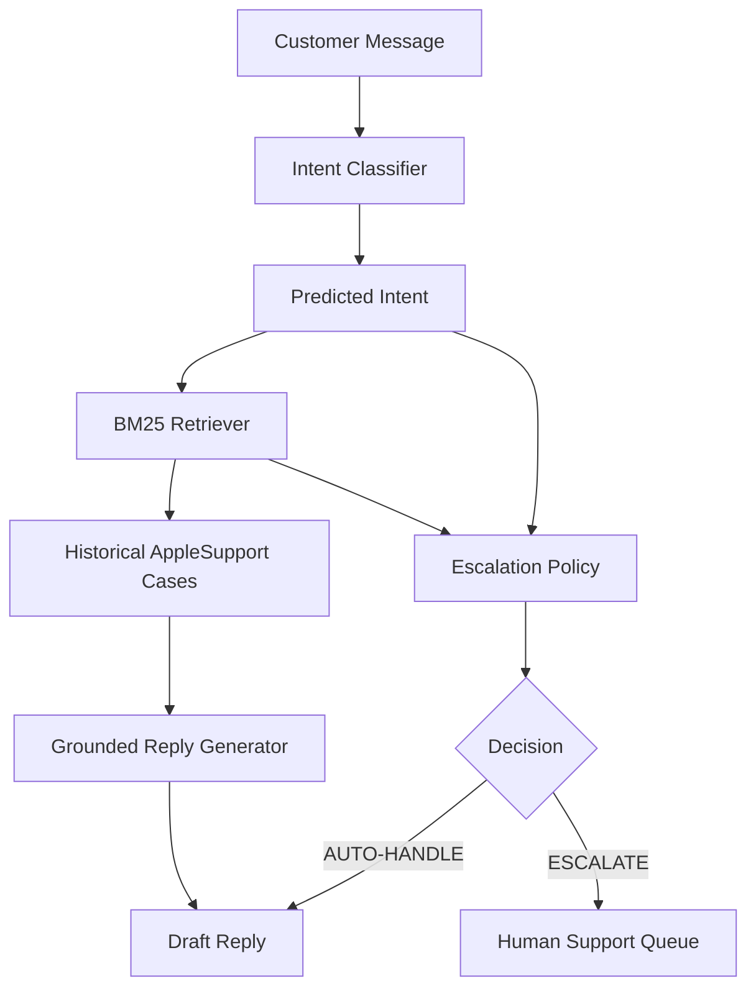

```mermaid
flowchart TD
    A[Customer Message] --> B[Intent Classifier]
    B --> C[Predicted Intent]
    C --> D[BM25 Retriever]
    D --> E[Historical AppleSupport Cases]
    E --> F[Grounded Reply Generator]
    C --> G[Escalation Policy]
    D --> G
    F --> H[Draft Reply]
    G --> I{Decision}
    I -->|AUTO-HANDLE| H
    I -->|ESCALATE| J[Human Support Queue]
```
