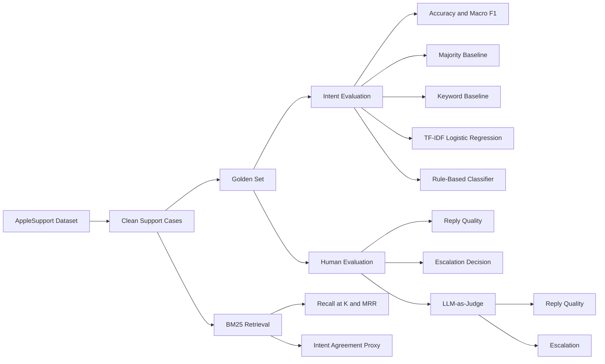

```mermaid
flowchart LR
    A[AppleSupport Dataset] --> B[Clean Support Cases]
    B --> C[Golden Set]

    C --> D[Intent Evaluation]
    D --> D1[Accuracy and Macro F1]
    D --> D2[Majority Baseline]
    D --> D3[Keyword Baseline]
    D --> D4[TF-IDF Logistic Regression]
    D --> D5[Rule-Based Classifier]

    C --> E[Human Evaluation]
    E --> E1[Reply Quality]
    E --> E2[Escalation Decision]

    B --> F[BM25 Retrieval]
    F --> F1["Recall at K and MRR"]
    F --> F2["Intent Agreement Proxy"]

    E --> G[LLM-as-Judge]
    G --> G1[Reply Quality]
    G --> G2[Escalation]
```
