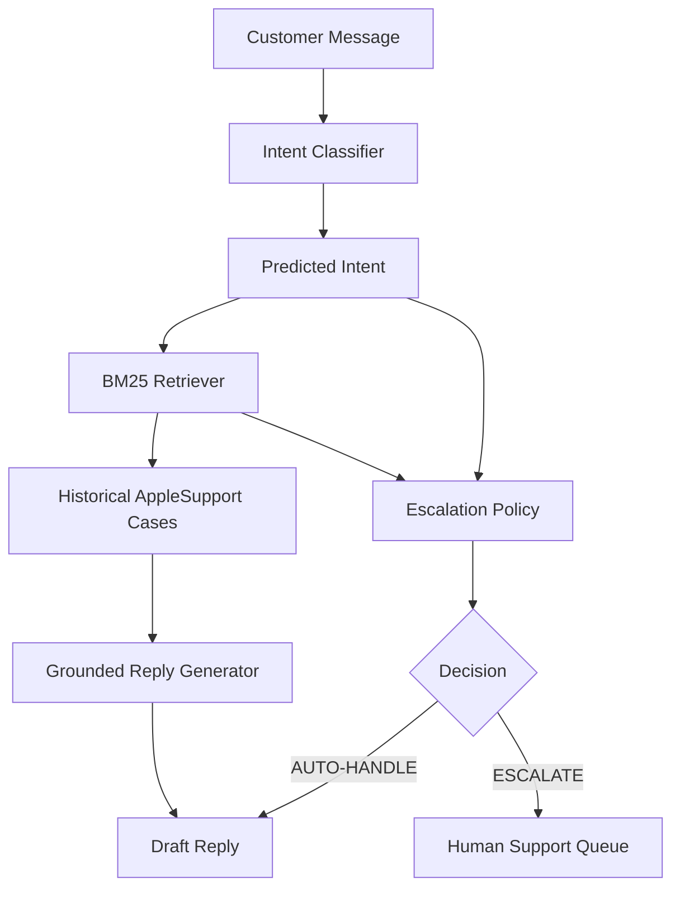

# SupportLens
## AI Customer Support Agent for AppleSupport

### 1. Problem
Customer support on social media platforms like Twitter is characterized by high volume, urgent technical requests, and the expectation of rapid, accurate responses. Brands face a significant challenge in scaling human support teams to handle repetitive queries while maintaining quality. The objective of SupportLens is to automate initial triage, information retrieval, and draft response generation for AppleSupport, effectively resolving standard technical issues autonomously while safely escalating high-risk, complex, or sensitive problems to human agents.

### 2. Dataset and Problem Construction
The project utilizes the Kaggle "Customer Support on Twitter" dataset (`thoughtvector/customer-support-on-twitter`). 
- **AppleSupport Selection**: From the 2,811,774 total tweets, we filtered for those involving AppleSupport (April 14, 2017 – September 27, 2017), yielding 106,860 tweets and 106,646 valid direct customer-response pairs.
- **Conversation Reconstruction**: To provide adequate context, we reconstructed support threads, initially yielding 102,121 threads.
- **Cleaning**: Low-information cases (e.g., simple greetings) were filtered out, resulting in 94,362 cleaned cases used for downstream retrieval.
- **Intent Discovery**: Based on observed messages, we defined an 11-intent taxonomy (e.g., `ios_update`, `battery_charging`, `hardware_display`, `other_insufficient_information`).
- **Golden Set**: We manually labelled a 200-example golden set to serve as the foundation for evaluation.

### 3. System Architecture
SupportLens operates as a sequential pipeline combining intent classification, historical case retrieval, grounded response generation, and a deterministic safety-oriented escalation policy.

- **Intent Classification**: Predicts one of 11 distinct problem categories from the customer's message.
- **BM25 Retrieval**: Searches the 94,362 cleaned historical cases to find highly relevant past resolutions matching the current problem.
- **Grounded Generation**: Uses the retrieved historical cases as factual grounding to draft a helpful, accurate reply.
- **Escalation**: A deterministic policy checks for safety concerns (e.g., fire hazards), data loss, account issues, missing retrieval evidence, and unsupported intents to decide whether to `ESCALATE` to a human or `AUTO-HANDLE`.

### 4. Baselines
To validate the complexity of the task, several baselines were evaluated on an earlier subset of the golden set:
- **Majority baseline**: Accuracy = 37.50%, Macro F1 = 0.0496
- **Keyword baseline**: Accuracy = 60.00%, Macro F1 = 0.5103
- **TF-IDF + Logistic Regression**: Accuracy = 40.00%, Macro F1 = 0.2167

*Note: The baseline split differs from the current 50-case human evaluation set used below.*

### 5. Evaluation
The following metrics represent the current system's performance on the 50-case human evaluation set.

| Component | Metric | Result |
|-----------|--------|--------|
| **Intent** | Accuracy | 76.00% |
| | Macro F1 | 0.7899 |
| **Retrieval** | Recall@1 | 50.00% |
| | Recall@3 | 78.00% |
| | Recall@5 | 82.00% |
| | MRR | 0.6367 |
| **Reply** | Acceptable-or-better | 92.00% |
| **Escalation** | Accuracy | 84.00% |
| | ESCALATE Precision | 1.0000 |
| | ESCALATE Recall | 0.8298 |

*Retrieval Notes: Recall@K and MRR are intent-agreement proxy metrics, not manually judged relevance. The evaluation is leakage-safe (the query's own conversation is removed).*

### 6. Failure Analysis
An inspection of system errors highlighted five primary failure modes:
1. **Multiple symptoms / competing intents**: Multiple valid keywords trigger different intents (e.g., battery vs hardware issues). 
2. **Generic update language overwhelms the actual problem**: Mentions of an "update" dominate the classification, masking the true problem (e.g., an audio jack issue).
3. **Ambiguous how-to / feature requests**: How-to queries share vocabulary with bug reports, leading to misclassification as technical failures.
4. **Account/data cases overlap lexically**: High vocabulary overlap (e.g., "icloud") confuses account access issues with data sync problems.
5. **Escalation depends too heavily on retrieval availability**: High-risk cases are sometimes mistakenly auto-handled merely because historical retrieval evidence exists.

### 7. What is misleading about my headline number?
The headline metrics should not be interpreted as unbiased estimates of production performance. The 50-case human evaluation set was also used during development and rule refinement. In addition, retrieval Recall@K and MRR use intent agreement as a proxy for relevance rather than direct human relevance labels. The LLM-as-judge evaluation was attempted, but the re-evaluation after rubric refinement was blocked by the external provider's daily free-tier request limit. Stale pre-refinement judge outputs were therefore excluded from the reported headline metrics.

### 8. Next-week plan
To advance the system toward production readiness, the following steps are planned:
- Build a larger held-out evaluation set.
- Add manually judged retrieval relevance labels.
- Replace proxy retrieval metrics with human relevance metrics.
- Improve multi-intent/primary-symptom classification.
- Improve how-to vs technical-issue detection.
- Add confidence calibration.
- Test stronger semantic retrieval such as embeddings/hybrid BM25.
- Re-run LLM judge with a stable/paid model.
- Measure latency and cost.
- Test end-to-end robustness on unseen cases.
